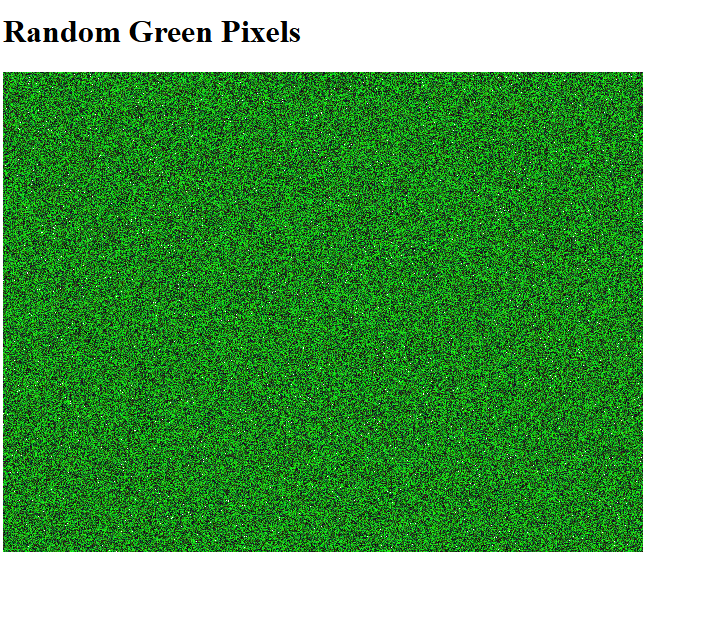

# Random Green Pixels with WASM & AssemblyScript

A WebAssembly module written in AssemblyScript that generates random green pixels.



## Features

- Canvas
- ImageData
- Framebuffer
- Memory
- requestAnimationFrame

## Installation

1. Clone this repository:

```bash
git clone https://github.com/krondorl/random-green-as-wasm.git
cd random-green-as-wasm
```

2. Install dependencies:

```bash
npm install
```

3. Build the project:

```bash
npm run asbuild
```

4. Test the project:

```bash
npm run test
```

5. Run the project in browser:

```bash
npm start
```

## License

Please check out [LICENSE](LICENSE) and [NOTICE](NOTICE) files.

## Links

- [AssemblyScript Documentation](https://www.assemblyscript.org/)
- [WebAssembly Official Site](https://webassembly.org/)
- [MDN WebAssembly](https://developer.mozilla.org/en-US/docs/WebAssembly)
- [AssemblyScript - HTTP 203](https://www.youtube.com/watch?v=u0Jgz6QVJqg)
- [Introduction to Web Assembly](https://young.github.io/intro-to-web-assembly/)
- [Wasm By Example](https://wasmbyexample.dev/home.en-us.html)

## History

- September 2025: Initial release
